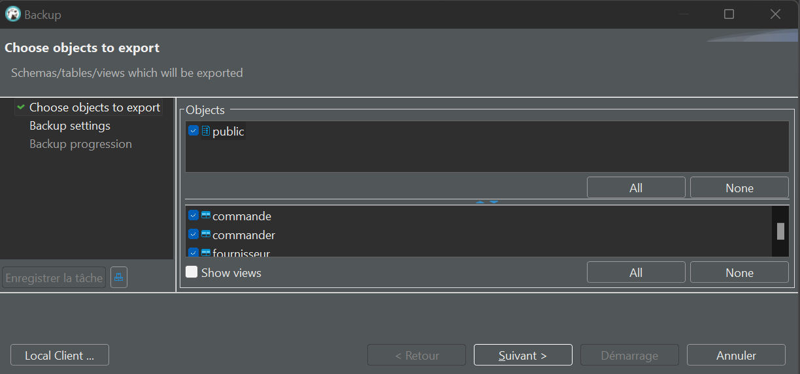
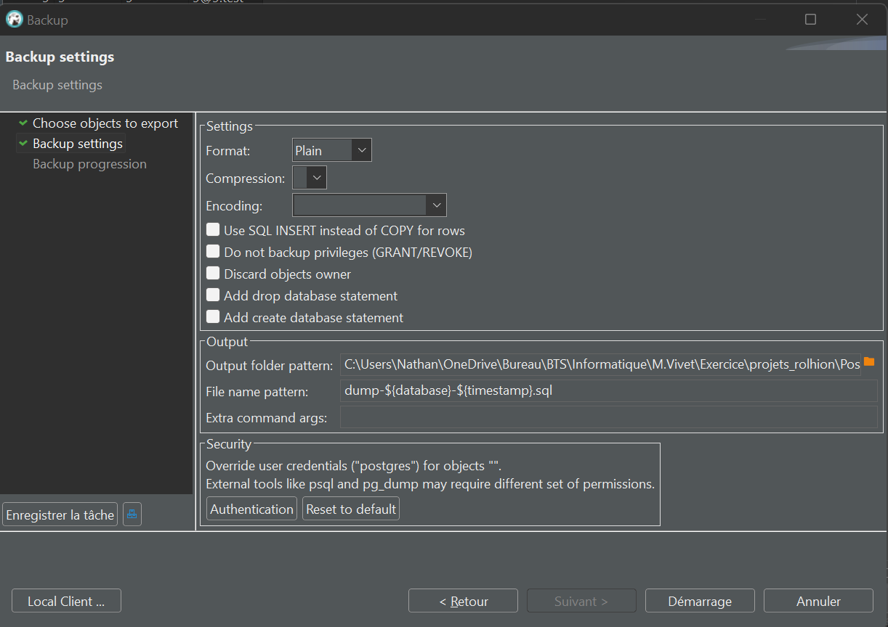

# DBeaver

## Backup d'une base de données au format SQL :

- Clic droit sur la base de données à backup. 

- Selectionné l'objet et les tables à backup.

- Choisir le format plain, choisir l'endroit où on souhaite qu'il soit enregistré et changer le nom si besoin.

