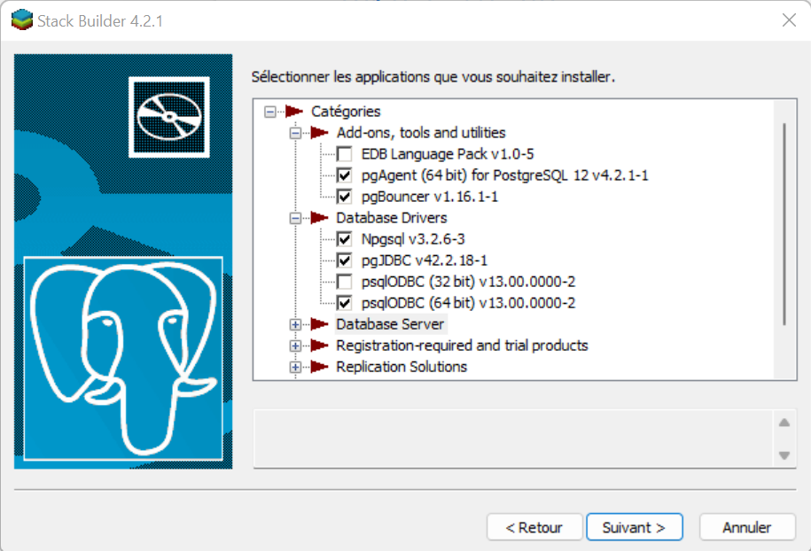
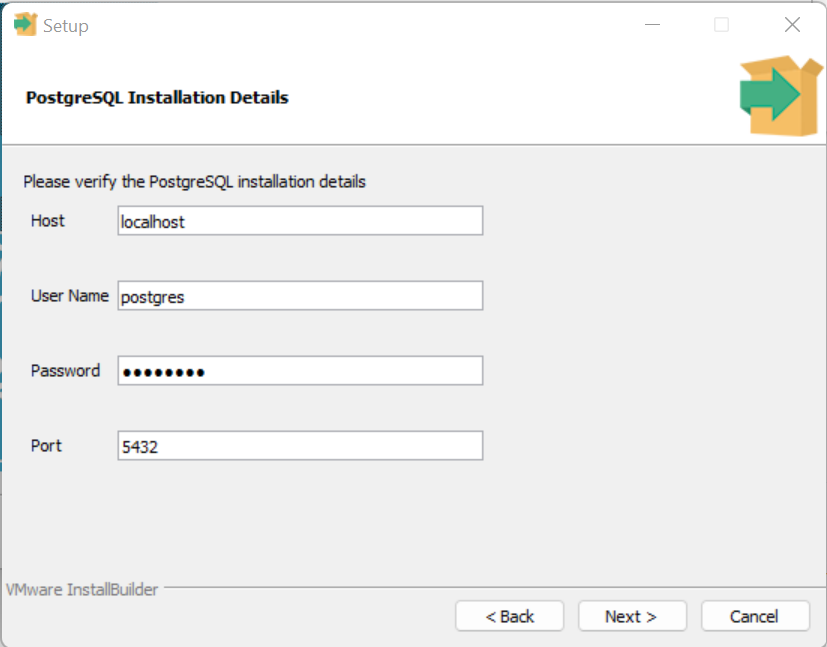
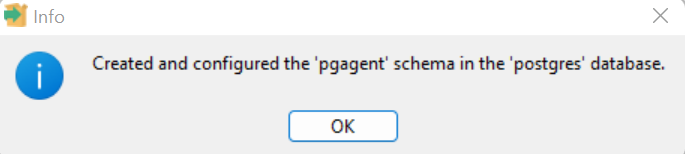
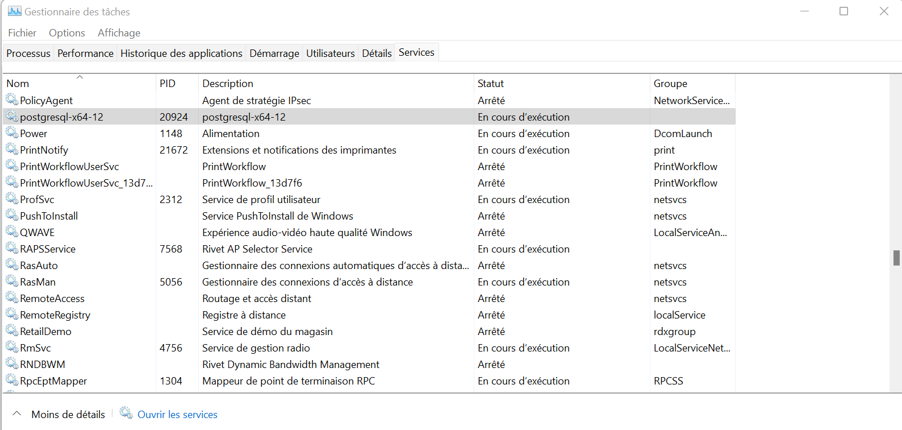
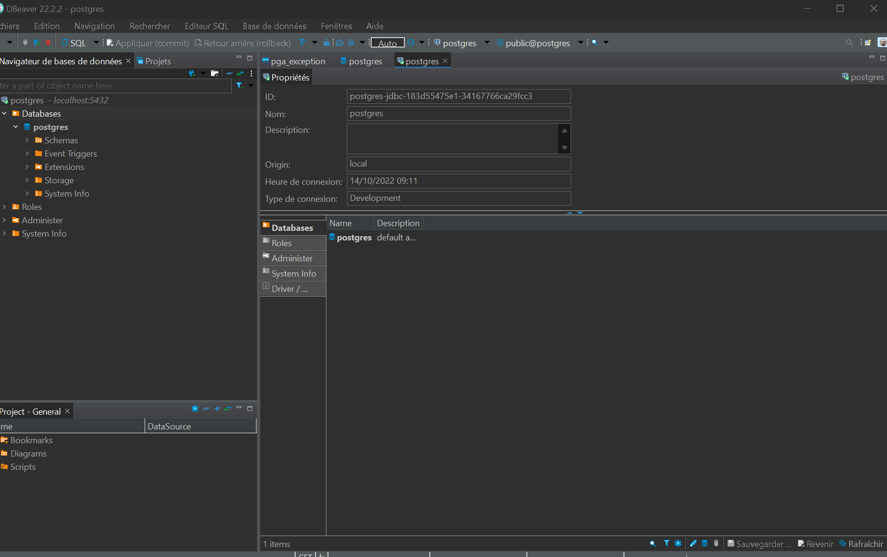

# Installation de postgreSQL et de DBeaver

#### Installation de postgreSQL :

Nous allons utiliser la <u>version 12</u> de postgreSQL

Nous allons le répertoire d'installation par défaut qu'est : <u>C:\Program Files\PostgreSQL\12</u>

#### Les composants d'installation proposé est :

*PostgreSQL Server* : Ceci est le service serveur de postgre

*pgAdmin 4* : Est un client proposé avec postgre qui permet de visualiser et de créer des bases sur le serveur.

*Stack Builder* : Stack Builder permet l'installation et le télécharge du module postgreSQL  via une interface graphique.

*Command Line Tools* : Command Line permet la prise en charge de postgreSQL via une interface en ligne de commande.

**Nous allons faire une installation de ces 4 composants.**

### Repertoire des données

Le répertoire des données sera celui proposé par défaut.<u> C:\Program Files\PostgreSQL\12\data</u>

### Mot de passe superutilisateur :

Le mot de passe que nous allons fournir est postgres

### Le port d'écoute :

Le port par défaut de postgreSQL est 5432. Nous allons utilisé ceci.

## Stack Builder

#### Les applications qu'on souhaite installer

Lors de l'installation de Stack Builder, il nous propose de choisir des applications. 

Nous allons installer : 

pgAgent (64 bit) for PostgreSQL

pbBouncer

EDB Language Pack

pgJBDC

psqlOBDC (64 bit)

Npgsql

### Répertoire de télechargement :

Nous utiliserons le repertoire par défaut.

## Installation de NpgSQL

Nous utiliserons le répertoire d'installation par défaut : C:\Program Files (x86)\PostgreSQL\Npgsql

## Installation de pgAgent

Verification de l'installation de PostgreSQL 

#### pgAgent Service Account :

Nous allons mettre le même mot de passe pour l'installation de postgreSQL

Si ce message s'affiche, c'est que l'installation c'est bien terminé sans encombre. 

### PgBouncer :

On fait pareil que pour pgAgent, on vérifie la présence du serveur en s'y connectant.

PgBouncer à pour défaut le port 6432. 

### pgJBDC :

Le dossier d'installation sera celui par défaut. C:\Program Files (x86)\PostgreSQL\pgJDBC

### psqlODBC :

Le dossier d'installation sera celui par défaut. C:\Program Files\PostgreSQL\psqlODBC

L'installation complète de Stack Builder est terminé. Nous pouvons donc vérifié la présence du service. 

Il est actuellement bien présent sur l'ordianateur et celui-ci est actuellement en cours d'execution.

# Installation de DBeaver.

## Version de DBeawer : Community 22.2

### Les composant proposé :

DBeaver Community 

Include Java

Reset Setting

Associate .SQL Files

Nous allons uniquement faire l'installation de DBeaver et Include Java.

### Le dossier d'installation

Nous utiliserons le dossier d'installation par défaut.  C:\Users\\$User\AppData\Local\DBeaver

## Execution de DBeaver

Connexion au serveur et installation des pilotes PostgreSQL.

Nous sommess bien connecter au serveur : 

